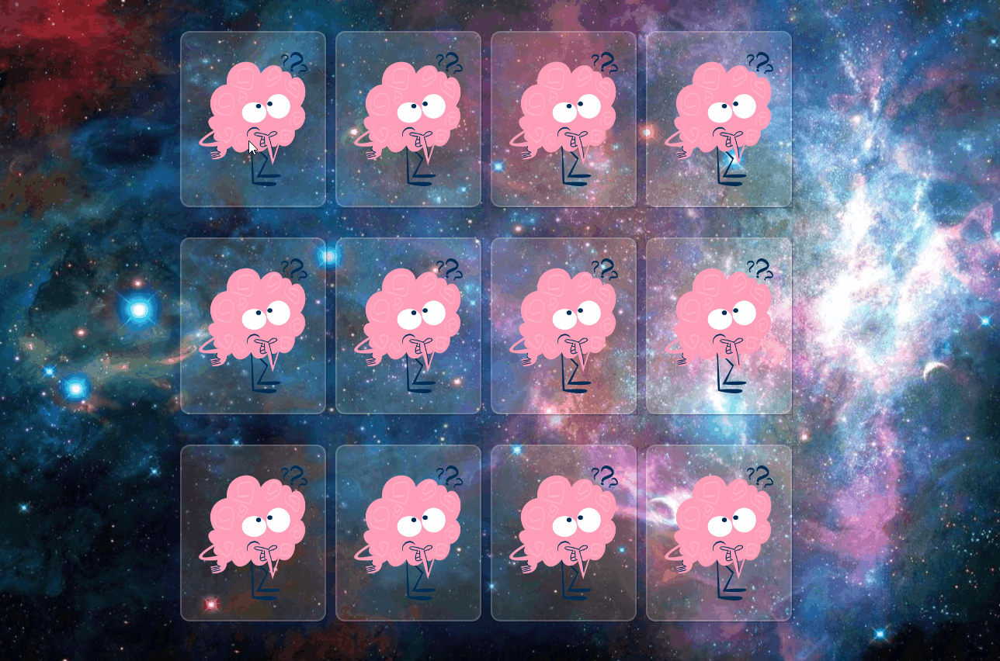

 
  

<h1 align="center">

Vanilla-Memory-Game by [Raquel Peña](https://www.linkedin.com/in/raquel-pe-go/)

</h1>

<h2 id="table-of-contents"> __φ(。。)  Table of Contents</h2>

  
Table of Contents

  <ul>
    <li><a href="#about-the-project">  About the project</a></li>
    <li><a href="#how">  What it is and how to play</a></li>
    <li><a href="#fun">  Fun stuff</a></li>
    <li><a href="#learned">  What I have learned and reviewed</a></li>
    <li><a href="#make-it-yours">  What you need to make it yours</a></li>
    <li><a href="#responsive">  I'm responsive</a></li>
    <li><a href="#who">  Who is Raquel </a></li>
  </ul>

 </img>

<h2 id="about-the-project"> ٩(◕ ‿◕｡)۶  About the project</h2>

Since I was little I always liked this game, I used to play with cards and although I always had to look for the same animals, that didn't make me like the game any less.

Today I would like to share with you my version of the game, I have made it using this [tutorial](https://www.youtube.com/watch?v=eMhiMsEC9Uk&list=PLLX1I3KXZ-YH-woTgiCfONMya39-Ty8qw&index=4) and bringing a little bit of my magic.

 </img>

<h2 id="how"> (ﾉ´ヮ`)ﾉ*: ･ﾟ  What it is and how to play</h2>

The game consists of finding the pair of each image. Here is an example:

</img>

What happens if they don't match? <strong>NOTHING</strong>, try again :sparkling_heart: No maximum attempts here.

</img>

 </img>

<h2 id="fun"> \(★ω★)/   Fun stuff</h2>

  
We  LOVE  Fun ( click me )

<ul >
<li>If you have clicked on two images and they do not match, you cannot click again until they are rotated:       </img>  </li>

<li>

When you have finished, you will hear a [sound](https://soundbible.com/2157-Text-Message-Alert-4.html) and a button will be activated to start over.

 </img>

</li>
</ul>

 </img>

<h2 id="learned"> (o･ω･o)  What I have learned and reviewed</h2>

<ul>
<li>

A better understanding of how it works position [absolute](https://www.youtube.com/watch?v=VFt_n4M9Vyk&ab_channel=CodeSketch).

</li>
<li>

[3D Effect](https://www.quackit.com/css/css3/properties/css_transform-style.cfm) for rotating images.

</li>
<li>

Use of [data](https://developer.mozilla.org/en-US/docs/Learn/HTML/Howto/Use_data_attributes) atributtes to know which image has been rotated and to know if they match

</li>

<li>

Random position of images: [IIFE](https://developer.mozilla.org/en-US/docs/Glossary/IIFE) so that the function is executed immediately once it has been declared and with [style.order](https://developer.mozilla.org/en-US/docs/Web/CSS/order) that will modify the position of the images, instead of having all of them in position 0 (it is by default) thanks to Math.floor(Math.random() \* 12) they have a number assigned up to 12 randomly.

</li>

</ul>

 </img>
<h2 id="make-it-yours"> (๑˘︶˘๑)  What you need to make it yours</h2>

It is made with HTML, Css and Javascript so you don't need anything special. You can play directly by clicking on the [link](https://rpg87.github.io/Vanilla-Memory-Game/), you can fork the project or you can download the entire game. It is up to you.

 </img>

<h2 id="responsive"> ( ￣ー￣)φ__  I am responsive</h2>

You can play from any device you choose

 </img>

<h2 id="who"> (≧▽≦)/  Who is Raquel</h2>

 I am Raquel, I consider myself a person with a great sense of humor, always eager to learn, a lover of challenges and this combination is what led me to study web development.

If you want to know more about me or if you have a fun project and you need help we could work together, you can find me [here](https://www.linkedin.com/in/raquel-pe-go/)

 </img>

<h2>If you have made it this far, I thank you from the bottom of my heart. 
(=^･ω･^=) </h2>
